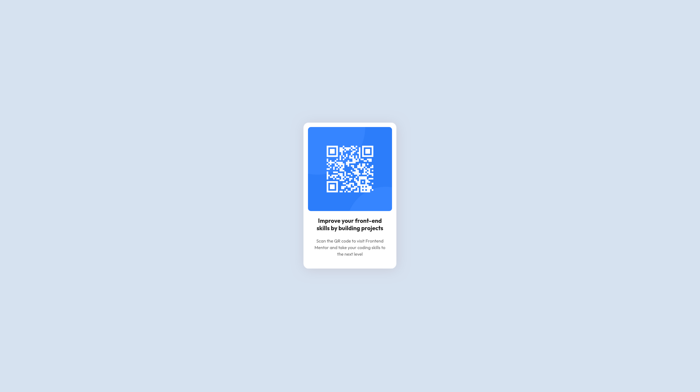

# Frontend Mentor - QR code component solution

This is a solution to the [QR code component challenge on Frontend Mentor](https://www.frontendmentor.io/challenges/qr-code-component-iux_sIO_H). Frontend Mentor challenges help you improve your coding skills by building realistic projects. 

## Table of contents

- [Overview](#overview)
  - [Screenshot](#screenshot)
  - [Links](#links)
- [My process](#my-process)
  - [Built with](#built-with)
  - [What I learned](#what-i-learned)
  - [Continued development](#continued-development)
  - [Useful resources](#useful-resources)
- [Author](#author)
- [Acknowledgments](#acknowledgments)

## Overview

### Screenshot




### Links

- Solution URL: [Add solution URL here](https://github.com/yohans-kasaw/qr-code-component-main)
- Live Site URL: [Add live site URL here]()

### Built with
- vite
- vue
- vuetify

### What I learned
importing fonts. And after than having a class for them.

```css
.font-outfit {
    font-family: 'Outfit', sans-serif;
    font-optical-sizing: auto;
}
```

### Continued development

-> nothing

### Useful resources

- https://developer.mozilla.org/en-US/docs/Web/CSS/box-shadow
    - it was help full making the shadow look good

## Author

- Website - [yohans kasaw](https://yohans-kasaw.github.ido/)
- Frontend Mentor - [@yohans-kasaw](https://www.frontendmentor.io/profile/yohans-kasaw)
- GitHub - [@yohans-kasaw](https://github.com/yohans-kasaw)

**Note: Delete this note and add/remove/edit lines above based on what links you'd like to share.**

## Acknowledgments

-> nobody sofar
